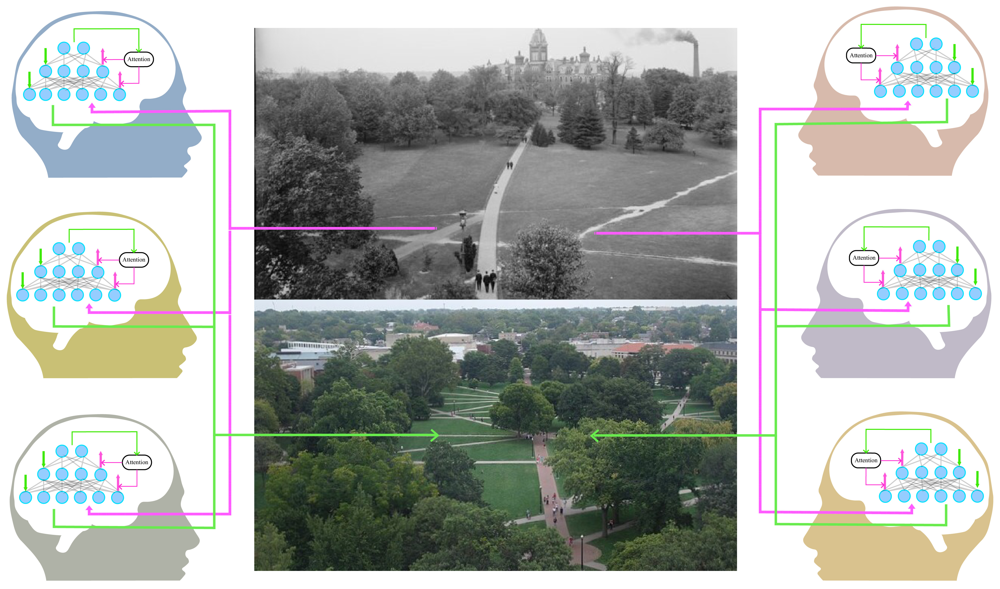
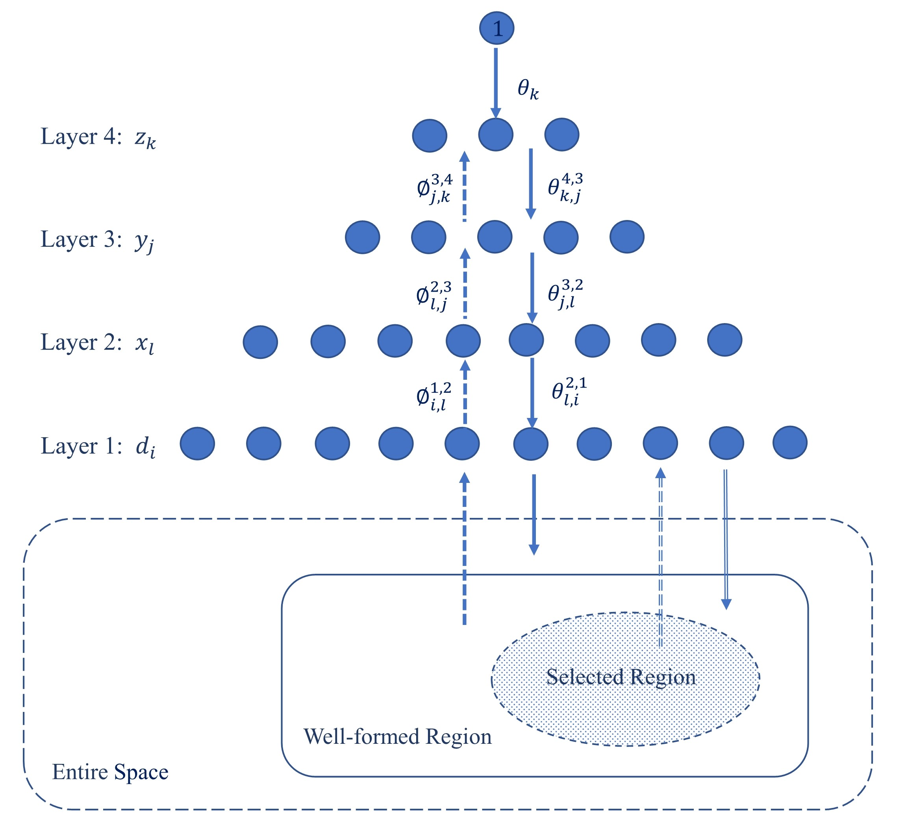

# Helmholtz-Embodied-Inference-Salience-Sampling

In this research, we integrate action (salience sampling) into [perception](https://www.nature.com/articles/s41598-017-15249-0) to study the enactive, [embodied mind](https://pubmed.ncbi.nlm.nih.gov/29887647/) and [situated agents](https://www.fil.ion.ucl.ac.uk/~karl/Whatever%20next.pdf) by the unified brain theory – the [Free Energy Principle](https://www.nature.com/articles/nrn2787), with an implementation within the Helmholtz machine infrastructure.

- The very first paper of this research, [A Neural Network Implementation for FEP](https://arxiv.org/abs/2306.06792), was presented at the 4th International Workshop on Active Inference (IWAI 2023), in Ghent, Belgium [[poster](https://drive.google.com/file/d/1WcqMUxAj-YVRW33nfturlazXT17N-bms/view)].
- The blueprint of this research was outlined in my publication [A New Theory of Data Processing: Applying Artificial Intelligence to Cognition and Humanity](https://dl.acm.org/doi/abs/10.1145/3577190.3616123), presented at the 25th ACM International Conference on Multimodal Interaction (ICMI 2023), Paris, France, as the [Blue Sky Paper](https://icmi.acm.org/2023/call-for-blue-sky-papers/) that "emphasizes innovative, visionary, and high-impact contributions" [[paper award](https://drive.google.com/file/d/17B7YcH6yYmIA72H0vBXe0V1XoZg0GK5a/view?usp=sharing), [presentation](https://drive.google.com/file/d/1TiFpsldkKIJ5-Z7B6uTRh9AKJnBTmJ56/view), [Kudos](https://www.growkudos.com/publications/10.1145%25252F3577190.3616123/reader)].
- Presented at the [GenAI Summit 2025](https://genaisummit2025.ucsd.edu/) at UC San Diego [[poster](https://drive.google.com/file/d/1Gp1lqMNEjelwnmr1F7LP57hrafd9EsJ6/view?usp=sharing)].
- This work is detailed in Chapter 5 of my [Ph.D. qualification writing](https://drive.google.com/file/d/1CNLO2FjDNW5RT0Zfc70ynZeVdm-KQsTH/view?pli=1), 2024, and included in the Chapter 3 of my [Ph.D. dissertation](https://www.proquest.com/openview/581cd124d0c14930d566ba9010cecd67/1?pq-origsite=gscholar&cbl=18750&diss=y), 2025.

<caption>
 Figure 1: Multi-agent Niche Construction. 
</caption>

## Research

- Extended Helmholtz machine’s variational learning objective with the free energy principle by incorporating the artificial agent’s motor action via active sampling. Sampling salience led to the exclusion of false positives, thereby reinforcing the agent’s bias.
- Besides unilaterally simulating the agent’s decision-making by the Helmholtz machine, where the key move is to create a symmetry between internal and external states under a reciprocal exchange between the agent and its environment, we established the Helmholtz action-perception loop for simulating [communication](https://www.fil.ion.ucl.ac.uk/~karl/Active%20inference,%20communication%20and%20hermeneutics.pdf) and [niche construction](https://sandervandecruys.be/pdf/2020_VandeCruysHeylighenBBS_Dark_side.pdf).
- The free energy principle is widely applied in various fields such as [psychology](https://pmc.ncbi.nlm.nih.gov/articles/PMC2850580/), [music](https://pubmed.ncbi.nlm.nih.gov/30471869/), [linguistic communication](https://www.sciencedirect.com/science/article/pii/S0149763420304668?via%3Dihub), [cultural niche construction](https://royalsocietypublishing.org/rsif/article/15/141/20170685/64914/A-variational-approach-to-niche-constructionA), [embodiment](https://link.springer.com/article/10.1007/s11229-016-1288-5), [autopoiesis](https://royalsocietypublishing.org/rsif/article/15/138/20170792/35768/The-Markov-blankets-of-life-autonomy-active), and [emotion recognition](https://www.frontiersin.org/journals/computational-neuroscience/articles/10.3389/fncom.2020.00030/full). By bridging FEP and AI, this research lays the foundation for the study of cognition and humanity within the broader context of artificial intelligence.

<caption>
 Figure 2: Helmholtz Machine in Salience Sampling. 
</caption>
